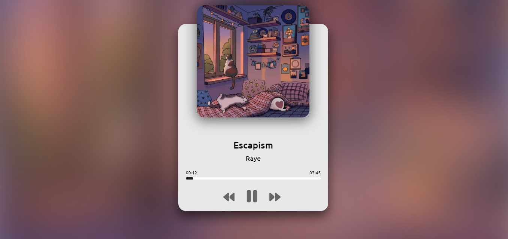

# Music-Player Base Html, Css, Java Script

If you want run this source run use live  Host do not run as Debug

# How To put more song And Picture Song?

- Find sond u want to put inside Must mp3 file 

- For picture must png file 

- Open Index.js

- add same code like other code for connect file to ur code for example i add picture and music  so i name it 1.png then i go the code index.jd and put the path like this  (path: 'assets/1.mp3') for picture like this  (cover: 'assets/1.jpg',)

- Remember (path= for music and cover= for picture)

- Dont delete any code inside this program or your progam become broken

- remember put sampe path in code to ur file

-  save code and refesh ur page

# Dont forget give me pull request, Fork, And Star ^-^
